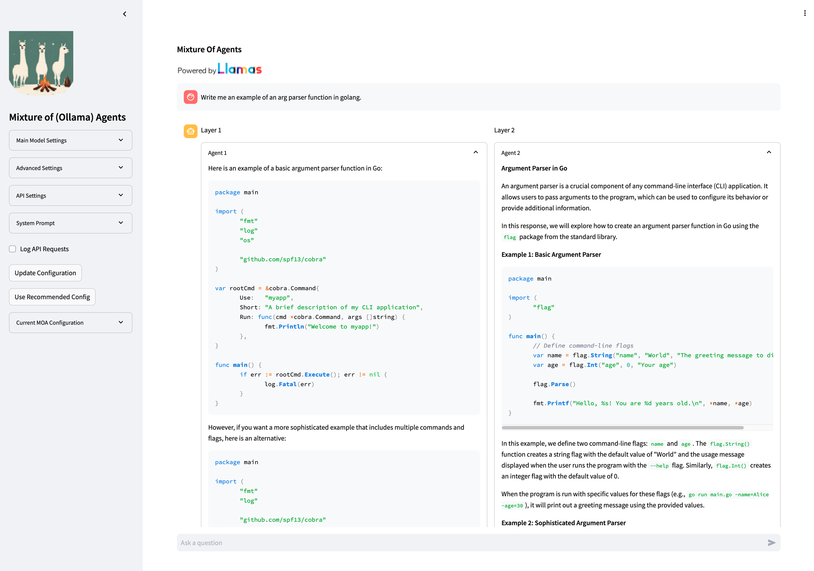
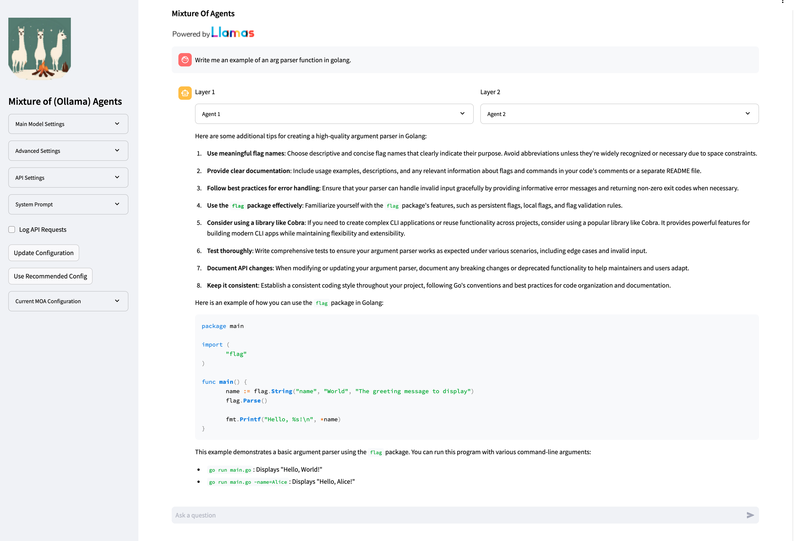
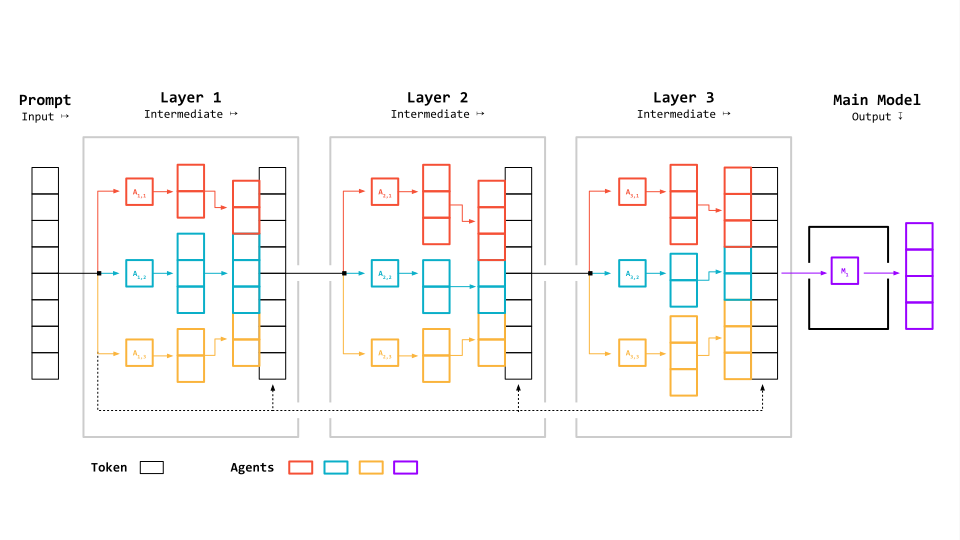

# Mixture-of-Agents Powered by Ollama

This Streamlit application showcases the Mixture of Agents (MOA) architecture proposed by Together AI, powered by any Ollama compatible API (including Ollama). It allows users to interact with a configurable multi-agent system for enhanced AI-driven conversations.

Agent responses (layer agents):



Final (mixture) response (main model):




*Source: Adaptation of [Together AI Blog - Mixture of Agents](https://www.together.ai/blog/together-moa)*

## Features

- Interactive chat interface powered by MOA
- Configurable main model and layer agents
- Real-time streaming of responses
- Visualisation of intermediate layer outputs
- Customisable agent parameters through the UI

## Installation

1. Clone the repository:
   ```
   git clone https://github.com/sammcj/moa.git
   cd moa
   ```

2. Install the required dependencies:
   ```
   pip install -r requirements.txt
   ```

3. Set up your environment variables:
   Create a `.env` file in the root directory and add your Ollama compatible base URL and API key:
   ```
   OLLAMA_HOST=http://localhost:11434
   OLLAMA_API_KEY=ollama
   ```

## Usage

1. Run the Streamlit app:
   ```
   streamlit run app.py
   ```

2. Open your web browser and navigate to the URL provided by Streamlit (usually `http://localhost:8501`).

3. Use the sidebar to configure the MOA settings:
   - Select the main model
   - Set the number of cycles
   - Customize the layer agent configuration

4. Start chatting with the MOA system using the input box at the bottom of the page.

## Project Structure

- `app.py`: Main Streamlit application file
- `moa/`: Package containing the MOA implementation
  - `__init__.py`: Package initializer
  - `moa.py`: Core MOA agent implementation
  - `prompts.py`: System prompts for the agents
- `main.py`: CLI version of the MOA chat interface
- `requirements.txt`: List of Python dependencies
- `static/`: Directory for static assets (images, etc.)

## Configuration

The MOA system can be configured through the Streamlit UI or by modifying the default configuration in `app.py`. The main configurable parameters are:

- Main model: The primary language model used for generating final responses
- Number of cycles: How many times the layer agents are invoked before the main agent
- Layer agent configuration: A JSON object defining the system prompts, model names, and other parameters for each layer agent

## Contributing

Contributions to this project are welcome! Please follow these steps to contribute:

1. Fork the repository
2. Create a new branch for your feature or bug fix
3. Make your changes and commit them with descriptive commit messages
4. Push your changes to your fork
5. Submit a pull request to the main repository

Please ensure that your code adheres to the project's coding standards and includes appropriate tests and documentation.

## License

- The project was forked from [skapadia3214/moa](https://github.com/skapadia3214/groq-moa)
  - groq-moa was stated to be licensed under the MIT License - but it's [LICENSE.md](https://github.com/skapadia3214/groq-moa/blob/d994651b3353d62471bd22dd30098dd7977161b5/LICENSE) file contained the license for Apache 2.0.

## Acknowledgements

- [skapadia3214](https://github.com/skapadia3214/groq-moa) for their groq based MOA implementation
- [Ollama](https://ollama.com/) for providing the Ollama compatible API
- [Together AI](https://www.together.ai/) for proposing the Mixture of Agents architecture and providing the conceptual image
- [Streamlit](https://streamlit.io/) for the web application framework

## Citation

This project implements the Mixture-of-Agents architecture proposed in the following paper:

```
@article{wang2024mixture,
  title={Mixture-of-Agents Enhances Large Language Model Capabilities},
  author={Wang, Junlin and Wang, Jue and Athiwaratkun, Ben and Zhang, Ce and Zou, James},
  journal={arXiv preprint arXiv:2406.04692},
  year={2024}
}
```

For more information about the Mixture-of-Agents concept, please refer to the [original research paper](https://arxiv.org/abs/2406.04692) and the [Together AI blog post](https://www.together.ai/blog/together-moa).
